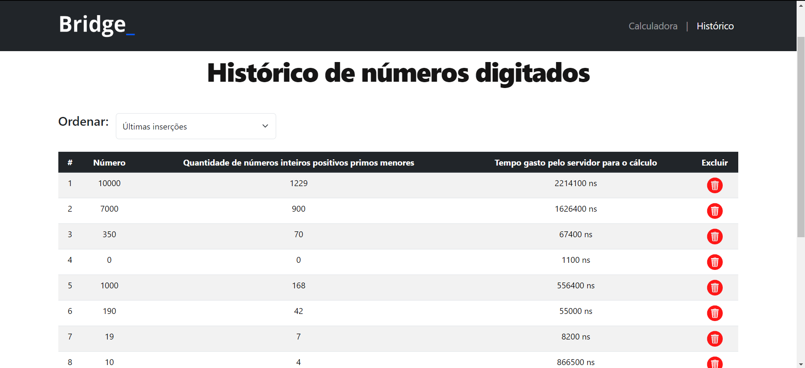

# Processo seletivo Bridge 2024.1 - Desenvolvedor Full Stack 

## Sobre o desafio:

Criar uma Aplicação Web, que permita que o usuário insira um número
inteiro k e calcule o número de inteiros positivos primos n MENORES que k.

## Principais tecnologias, ferramentas e técnicas utilizadas:
- Java com Springboot: funcionalidades do backend e cálculo dos números primos.
- Banco de dados MySQL: persistência dos dados para o histórico.
- Arquitetura MVC: estrutura de organização.
- HTML, CSS, Bootstrap e JavaScript puro: estilização, exibição e validações de entrada do frontend.
- API REST: padrão utilizado pelo servidor.
- JUnit: testes unitários.

## Requisitos
- Java JDK instalado.
- Maven instalado.
- XAMPP instalado (ou outro servidor MySQL)

## Instruções
### Clone do repositório
Faça um clone do respositório: 
```bash
git clone https://github.com/Henrique1803/SeletivaBridge24_1.git
```
### Configuração do banco de dados
1. Abra o XAMPP e inicie os serviços Apache e MySQL.
2. Crie um novo banco de dados chamado desafio_bridge.
3. Configure as credenciais de acesso ao banco de dados (username, password...) em `backend/SeletivaBridge24_1/src/main/resources/application.properties`

### Executando o Backend
1. Abra o terminal e navegue até diretório responsável pelo Backend:
```bash
cd backend/SeletivaBridge24_1
```
2. Execute o seguinte comando para construir o projeto:
```bash
mvn clean install
```
3. Em seguida, inicie o Spring Boot executando o comando:
```bash
mvn spring-boot:run
```
O backend estará em execução em `http://localhost:8080`

### Executando o Frontend
1. Abra o arquivo `index.html` localizado na pasta `frontend/index.html` em seu navegador web.
O frontend será carregado e você poderá interagir com a aplicação.

## Imagens das telas

Tela principal:<br><br>
  

Tela de históricos:<br><br>

