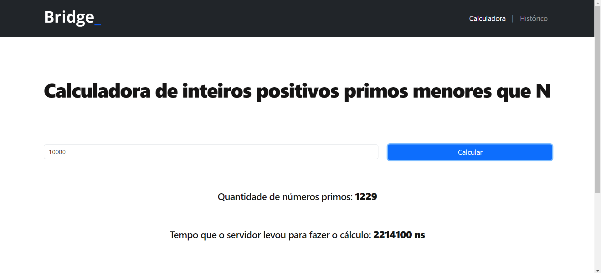

# Processo seletivo Bridge 2024.1 - Desenvolvedor Full Stack 

## Sobre o desafio:

Criar uma Aplicação Web, que permita que o usuário insira um número
inteiro k e calcule o número de inteiros positivos primos n MENORES que k.

## Principais tecnologias, ferramentas e técnicas utilizadas:
- Java com Spring Boot: Funcionalidades do backend e cálculo dos números primos.
- Banco de dados MySQL: Persistência dos dados para o histórico.
- Arquitetura MVC: Estrutura de organização.
- HTML, CSS, Bootstrap e JavaScript puro: Estilização, exibição e validações de entrada do frontend.
- API REST: Padrão utilizado pelo servidor.
- Padrão de projeto Strategy: Encapsula cada algoritmo que faz a contagem dos números primos menores que N em sua própria classe
e fornece uma interface comum para acessá-los. Assim é possível trocá-los sem precisar modificar o código que os utiliza.
- JUnit: Testes unitários para os três algoritmos de contagem de primos.

## Requisitos
- Java JDK instalado.
- Maven instalado.
- XAMPP instalado (ou outro servidor MySQL).

## Instruções
### Clone do repositório
Faça um clone do respositório: 
```bash
git clone https://github.com/Henrique1803/SeletivaBridge24_1.git
```
### Configuração do banco de dados
1. Abra o XAMPP e inicie os serviços Apache e MySQL.
2. Crie um novo banco de dados chamado desafio_bridge.
3. Configure as credenciais de acesso ao banco de dados (username, password...) em `backend/SeletivaBridge24_1/src/main/resources/application.properties`

### Executando o Backend
1. Abra o terminal e navegue até diretório responsável pelo Backend:
```bash
cd backend/SeletivaBridge24_1
```
2. Execute o seguinte comando para construir o projeto:
```bash
mvn clean install
```
3. Em seguida, inicie o Spring Boot executando o comando:
```bash
mvn spring-boot:run
```
O backend estará em execução em `http://localhost:8080`

### Executando o Frontend
1. Abra o arquivo `index.html` localizado na pasta `frontend/index.html` em seu navegador web.
O frontend será carregado e você poderá interagir com a aplicação.

## Testes unitários
### Sobre
Foram criados 5 testes unitários para cada um dos algoritmos que contam a quantidade de primos menores que N.
As classes de testes estão em: `backend\SeletivaBridge24_1\src\test\java\com\SeletivaBridge24_1\algoritmos`<br>
As classes testadas foram:
- AlgoritmoCrivoDeEratostenes
- AlgoritmoCrivoDeAtkin
- AlgoritmoPrincipal
<br><br>Os testes realizados foram:
1. testaParametroNegativo: Verificar se retorna 0 ao receber um número negativo como parâmetro (nesse caso a entrada foi -1).
2. testaParametroZero: Verificar se retorna 0 ao receber o número 0 como parâmetro.
3. testaParametroPequeno: Verificar se retorna 4 ao receber o número 10 (valor pequeno) como parâmetro.
4. testaParametroMedio: Verificar se retorna 1229 ao receber o número 10000 (valor médio) como parâmetro.
5. testaParametroGrande: Verificar se retorna 664579 ao receber o número 10000000 (valor grande) como parâmetro.
### Como executar
1. É necessário seguir as instruções do tópico "Configuração do banco de dados", caso elas não tenham sido executadas ainda, para inicializar os serviços.
2. Abra o terminal e navegue até diretório responsável pelo Backend:
```bash
cd backend/SeletivaBridge24_1
```
3. Faça o seguinte comando para executar os testes:
```bash
mvn test
```
Após a execução é possível análisar se os testes foram concluídos sem falhas. Ainda, também é possível
comparar a eficiência de cada algoritmo de contagem de primos, comparando o tempo decorrido de cada teste.

## Imagens das telas

Tela principal:<br><br>
  

Tela de histórico:<br><br>

